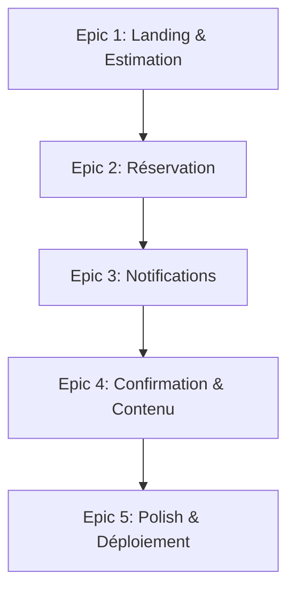

# VTC Rachel - Product Requirements Document (PRD) v2 - MVP Simplifié

<!-- Powered by BMAD™ Core -->

---

## Goals and Background Context

### Goals

- Fournir à Rachel un **site vitrine professionnel** pour présenter son service VTC premium
- Permettre aux clients potentiels d'**estimer instantanément le prix** d'une course (départ → arrivée → calcul automatique)
- Offrir un **formulaire de demande de réservation** simple qui envoie les détails à Rachel par email ET SMS
- Éliminer les frictions liées aux **réservations téléphoniques** (disponible 24/7 en ligne)
- Améliorer la **crédibilité et visibilité** de Rachel face aux grandes plateformes (Uber, G7)
- Servir de **support marketing** pour son partenariat hôtel (flyers avec QR code vers le site)
- Poser les bases pour **évolution future** vers automatisation si le business se développe
- Créer un **portfolio professionnel** pour la développeuse (projet École 42)

### Background Context

Rachel est chauffeur VTC dépendante d'Uber à ~90%, subissant des commissions de 25% et un rythme épuisant. Elle souhaite développer sa propre clientèle, notamment via un partenariat avec un hôtel où elle vise 5 courses aéroport par jour. 

Le site sera un outil de génération de leads : les clients potentiels découvrent le service, estiment le prix instantanément, et envoient une demande de réservation. Rachel reçoit la demande par **email ET SMS** pour notification instantanée, puis contacte le client directement pour confirmer. Le client reçoit un **message rassurant** ("Rachel vous contactera sous 2h") pour gérer l'attente. Pas besoin de gestion complexe au démarrage, mais l'architecture permet une **évolution facile vers l'automatisation** si le volume augmente.

### Change Log

| Date | Version | Description | Author |
|------|---------|-------------|--------|
| 2026-01-13 | 2.0 | PRD simplifié basé sur besoins réels de Rachel | Équipe VTC Rachel |
| 2026-01-09 | 1.0 | PRD initial complet (archivé dans prd-v1-archive.md) | Équipe VTC Rachel |

---

## Requirements

### Functional Requirements

**Site vitrine & Navigation**

- **FR1:** Le site affiche une landing page présentant le service VTC Rachel avec sections Hero, À propos, Tarifs, FAQ, Contact
- **FR2:** Le site inclut une navigation claire (menu) accessible sur tous les écrans
- **FR3:** Le site affiche les informations de contact (téléphone, email) visibles sur toutes les pages
- **FR4:** Le site affiche les zones desservies (Paris, IDF, aéroports CDG/Orly)
- **FR5:** Le site inclut les pages légales obligatoires (CGV, Mentions légales, Confidentialité)

**Estimation de prix (Landing page)**

- **FR6:** L'utilisateur peut entrer une adresse de départ avec autocomplétion Google Places API
- **FR7:** L'utilisateur peut entrer une adresse d'arrivée avec autocomplétion Google Places API
- **FR8:** Le système calcule automatiquement la distance via Google Distance Matrix API
- **FR9:** Le système affiche le prix estimé selon la grille tarifaire de Rachel (ex: 2€/km ou forfaits)
- **FR10:** Le système affiche la distance et le temps de trajet estimé
- **FR11:** L'utilisateur peut cliquer sur "Réserver maintenant" pour accéder à la page de réservation

**Page de réservation (/reserver) - Split screen**

- **FR12:** La page affiche un formulaire de réservation (côté gauche) et un bloc contact Rachel (côté droit)
- **FR13:** Le bloc contact affiche le téléphone de Rachel avec message "Une question ? N'hésitez pas à m'appeler !"
- **FR14:** Le formulaire de réservation collecte : nom, prénom, téléphone, email, date, heure, nombre de passagers
- **FR15:** Le formulaire permet d'ajouter des options : siège enfant, bagages volumineux, notes spéciales
- **FR16:** Le formulaire affiche un récapitulatif clair avant envoi (trajet, date/heure, prix, options)
- **FR17:** Le client choisit son mode de paiement : "En ligne" (futur) ou "En voiture"
- **FR18:** Le système valide tous les champs avant envoi (email valide, téléphone valide, date future)
- **FR19:** Le formulaire est protégé par Google reCAPTCHA v3 contre les bots et le spam

**Notifications**

- **FR20:** Quand une demande est envoyée, Rachel reçoit un **email** avec tous les détails de la réservation
- **FR21:** Quand une demande est envoyée, Rachel reçoit un **SMS** avec un résumé et lien vers l'email
- **FR22:** Le client reçoit un email de confirmation avec récapitulatif et message "Rachel vous contactera sous 2h"
- **FR23:** Les emails utilisent des templates professionnels avec le branding VTC Rachel

**Page de confirmation (/confirmation)**

- **FR24:** Après envoi réussi, l'utilisateur est redirigé vers une page de confirmation dédiée
- **FR25:** La page de confirmation affiche un message de succès avec animation
- **FR26:** La page affiche le récapitulatif complet de la demande envoyée
- **FR27:** La page affiche les prochaines étapes ("Rachel vous contactera sous 2h")
- **FR28:** La page affiche le téléphone de Rachel avec CTA "Appeler si urgent"

**Contenu & SEO**

- **FR29:** Le site est optimisé pour le référencement Google (meta tags, sitemap, structured data)
- **FR30:** Le site affiche des témoignages clients (si disponibles)
- **FR31:** Le site affiche la grille tarifaire complète (forfaits aéroports, majorations)
- **FR32:** Le site inclut une FAQ avec réponses aux questions courantes

---

### Non-Functional Requirements

**Performance & Accessibilité**

- **NFR1:** Le site doit charger en moins de 2 secondes (First Contentful Paint)
- **NFR2:** Le site doit être 100% responsive (mobile, tablette, desktop)
- **NFR3:** Le site doit respecter les standards d'accessibilité WCAG 2.1 niveau AA minimum
- **NFR4:** Le site doit fonctionner sur tous les navigateurs modernes (Chrome, Safari, Firefox, Edge)

**Sécurité & Protection**

- **NFR5:** Toutes les communications doivent utiliser HTTPS
- **NFR6:** Les données du formulaire doivent être validées côté serveur (protection injection)
- **NFR7:** Le site doit protéger contre le spam avec Google reCAPTCHA v3 (invisible, gratuit, efficace)
- **NFR8:** Les emails doivent être envoyés via un service sécurisé (Resend ou équivalent)
- **NFR9:** Le site doit être conforme RGPD (consentement cookies, politique confidentialité)

**Fiabilité**

- **NFR10:** L'envoi d'email ET SMS doit avoir un taux de délivrabilité > 95%
- **NFR11:** Le site doit avoir un uptime > 99% (disponibilité 24/7)
- **NFR12:** Le calcul de prix doit être exact et cohérent avec la grille tarifaire de Rachel
- **NFR13:** Si l'envoi d'email échoue, le système doit réessayer automatiquement (3 tentatives)

**Coûts & Budget**

- **NFR14:** Les coûts d'infrastructure doivent rester à 0€/mois au lancement
- **NFR15:** L'utilisation de Google Maps API doit rester dans les limites gratuites (200$/mois crédits)
- **NFR16:** Le site doit être hébergeable gratuitement sur Vercel (plan Hobby)
- **NFR17:** Les SMS doivent utiliser un service économique (Twilio : ~0.05€/SMS)

**Évolutivité**

- **NFR18:** Le code doit permettre d'ajouter facilement un système d'acompte en ligne (Stripe) en Phase 2
- **NFR19:** Le code doit permettre d'ajouter facilement un dashboard admin simple en Phase 2
- **NFR20:** Le code doit permettre d'ajouter une base de données (Supabase) sans refonte majeure

---

## User Interface Design Goals

### Overall UX Vision

**Philosophie Design : "Site vitrine premium accessible"**

L'application VTC Rachel doit être un **site vitrine simple mais impressionnant** qui inspire confiance et professionnalisme. L'objectif est de créer une expérience qui rassure le client, affiche clairement les informations essentielles, et rend l'estimation de prix + demande de réservation **extrêmement simple** (moins de 2 minutes).

**Principes directeurs :**
- **Confiance avant tout** : Design professionnel, témoignages, photos qualité, infos claires
- **Simplicité radicale** : Formulaires simples, pas de navigation complexe
- **Rapidité perçue** : Estimation de prix instantanée (< 1 seconde), feedback immédiat
- **Mobile-first absolu** : La plupart des clients réserveront depuis leur chambre d'hôtel (mobile)
- **Rassurance continue** : Messages clairs à chaque étape ("Rachel vous contactera", "Demande envoyée")

**Références d'inspiration :**
- **Uber** : Simplicité du formulaire (2 champs, prix immédiat)
- **Booking.com** : Messages rassurants ("Confirmation sous 2h")
- **Apple** : Minimalisme, attention au détail
- **Design actuel** : Garder le design premium existant (vert forêt + or champagne)

---

### Key Interaction Paradigms

**1. Estimation en 10 secondes (Landing page)**
```
Landing page → Formulaire d'estimation visible
├─ Champ "Départ" (autocomplétion Google Places)
├─ Champ "Arrivée" (autocomplétion Google Places)
├─ Bouton "Voir le prix" (vert, large)
└─ Prix affiché instantanément avec distance/temps
    └─ Bouton "Réserver maintenant" apparaît
```

**2. Page de réservation split screen (/reserver)**
```
Page dédiée avec layout split (Desktop)
├─ GAUCHE : Formulaire de réservation
│   ├─ Nom, prénom, téléphone, email
│   ├─ Date, heure
│   ├─ Passagers, options (bagages, siège enfant)
│   ├─ Notes spéciales
│   ├─ Choix paiement (en voiture par défaut)
│   ├─ Récapitulatif automatique
│   └─ Bouton "Envoyer la demande"
│
└─ DROITE : Bloc contact Rachel (sticky)
    ├─ Photo Rachel (optionnel)
    ├─ "Une question ?"
    ├─ Téléphone : 06 XX XX XX XX
    ├─ "Disponible 24/7"
    └─ "N'hésitez pas à m'appeler !"

Mobile : Formulaire en haut, bloc contact en bas
```

**3. Page de confirmation (/confirmation)**
```
Page de succès (après envoi)
├─ ✅ Animation de succès
├─ Message : "Demande envoyée avec succès !"
├─ Message : "Rachel vous contactera sous 2h"
├─ Récapitulatif complet de la demande
├─ "Un email de confirmation vous a été envoyé"
├─ CTA : "Appeler Rachel maintenant" (si urgent)
└─ Prochaines étapes (what happens next)
```

**4. Feedback rassurant à chaque étape**
```
Calcul prix → Loader 1s → Prix affiché ✅
Envoi demande → Loader 1-2s → Redirection confirmation ✅
Email envoyé → Notification client immédiate ✅
```

---

### Core Screens and Views

**Pages existantes (à garder) :**
1. ✅ Landing Page - Hero + Estimation prix + Features
2. ✅ Page Tarifs - Grille tarifaire
3. ✅ Page À propos - Présentation Rachel
4. ✅ Page FAQ - Questions fréquentes
5. ✅ Page Contact - Formulaire contact
6. ✅ Pages légales (CGV, Mentions légales, Confidentialité)

**Nouvelles pages à créer :**
7. 🆕 Page Réservation (`/reserver`) - Split screen (formulaire + contact Rachel)
8. 🆕 Page Confirmation (`/confirmation`) - Message de succès + récapitulatif

---

### Accessibility

**WCAG 2.1 niveau AA**
- Contrastes de couleurs respectés (vert forêt + blanc)
- Navigation au clavier fonctionnelle
- Labels explicites sur tous les champs de formulaire
- Messages d'erreur clairs et constructifs
- Textes alternatifs sur toutes les images

---

### Branding

**Déjà défini et implémenté :**
- **Couleurs** : Vert forêt (#0F4C3A) + Or champagne (#D4AF37)
- **Typographie** : Inter (texte) + Playfair Display (titres)
- **Style** : Minimalisme sophistiqué, luxe accessible
- **Animations** : Subtiles, fluides (Framer Motion)

**À compléter avec Rachel :**
- Logo VTC Rachel (si existe)
- Photos professionnelles (voiture, Rachel)
- Slogan précis

---

### Target Devices and Platforms

**Web Responsive (mobile-first)**
- **Priorité 1** : Mobile (80% des clients réserveront depuis smartphone)
- **Priorité 2** : Desktop (clients en préparation de voyage)
- **Support** : iOS Safari, Chrome Android, Chrome Desktop, Firefox, Edge

---

## Technical Assumptions

### Repository Structure

**Type : Monorepo Next.js**

Structure actuelle (maintenue) :
```
VtcR_app/
├── app/                    # Application Next.js
│   ├── app/               # Code Next.js (pages, composants)
│   ├── public/            # Images, assets
│   ├── package.json
│   └── [configs]
├── docs/                   # Documentation
└── .bmad-core/            # Méthodologie B-MAD
```

---

### Service Architecture

**Type : Monolithe Next.js serverless**

**Frontend :**
- Next.js 16 (App Router) avec Server Components
- React 19 pour interactivité

**Backend :**
- Next.js API Routes (serverless functions)
- Pas de base de données au MVP
- Services externes via API

**Services externes :**
- **Google Maps Platform** : Places API + Distance Matrix API (calcul prix)
- **Resend** : Envoi emails (gratuit jusqu'à 3000/mois)
- **Twilio** : Envoi SMS à Rachel (~0.05€/SMS)
- **Google reCAPTCHA v3** : Protection anti-spam (gratuit)

**Architecture simplifiée vs PRD v1 :**
- ❌ Pas de Supabase (pas de base de données)
- ❌ Pas de Stripe (pas de paiement en ligne au MVP)
- ❌ Pas d'authentification
- ✅ Services email/SMS uniquement

---

### Testing Requirements

**Niveau testing (MVP simplifié) :**
- **Unit tests** : Critique (calcul prix, validations, formatage)
- **Component tests** : Important (formulaires)
- **E2E tests** : Optionnel (post-MVP)

**Outils :**
- **Vitest** : Tests unitaires (déjà configuré ✅)
- **React Testing Library** : Tests composants (déjà installé ✅)

**Coverage cible :**
- Logique métier (calcul prix) : > 90%
- Composants UI : > 50%
- Overall : > 70%

---

### Additional Technical Assumptions

**Stack technique complète :**

```
Frontend :
- Next.js 16.1.1 (App Router)
- React 19
- TypeScript 5 (strict mode)
- Tailwind CSS 4
- Framer Motion 12 (animations)
- ShadCN UI (composants)

Backend :
- Next.js API Routes
- Zod (validation)

Services externes :
- Google Maps Platform (Places + Distance Matrix)
- Resend (emails transactionnels)
- Twilio (SMS)
- Google reCAPTCHA v3 (anti-spam)

Hébergement :
- Vercel (plan Hobby gratuit)
- Domaine : vtc-rachel.fr (~10€/an)

Monitoring :
- Vercel Analytics (inclus)
- Console logs structurés
```

**Environment Variables (.env.local) :**

```bash
# Google Maps
NEXT_PUBLIC_GOOGLE_MAPS_API_KEY=

# Resend (email)
RESEND_API_KEY=

# Twilio (SMS)
TWILIO_ACCOUNT_SID=
TWILIO_AUTH_TOKEN=
TWILIO_PHONE_NUMBER=
RACHEL_PHONE_NUMBER=

# reCAPTCHA
NEXT_PUBLIC_RECAPTCHA_SITE_KEY=
RECAPTCHA_SECRET_KEY=

# App
NEXT_PUBLIC_APP_URL=https://vtc-rachel.fr
RACHEL_EMAIL=
```

**Coûts estimés :**

```
Développement : 0€ (échange de services)
Domaine : 10€/an
Vercel : 0€/mois (plan Hobby)
Google Maps : 0€/mois (sous 28k requêtes)
Resend : 0€/mois (sous 3000 emails)
Twilio SMS : ~15€/mois (5 SMS/jour × 30 = 150 SMS × 0.10€)
reCAPTCHA : 0€ (gratuit)

Total : ~25€/mois (principalement SMS)
```

**Évolution possible (Phase 2) :**
- Ajouter Supabase (stockage réservations) : 0€ (plan gratuit)
- Ajouter Stripe (acompte en ligne) : commission 1.4% + 0.25€ par transaction

**Rationale (pourquoi ces choix) :**

**Simplifications vs PRD v1 :**
- ❌ Supabase retiré → Pas besoin de database pour MVP
- ❌ Stripe retiré → Pas de paiement en ligne au démarrage
- ✅ Resend ajouté → Emails gratuits
- ✅ Twilio ajouté → SMS critique pour Rachel
- ✅ reCAPTCHA v3 ajouté → Protection spam essentielle

**Architecture serverless :**
- Next.js API Routes = serverless (scale automatique)
- Pas de serveur à gérer
- Coûts = 0€ jusqu'à gros trafic

**Services externes uniquement :**
- Pas de gestion de serveurs
- Pas de maintenance complexe
- APIs fiables (Google, Twilio, Resend)

**Évolutivité préservée (NFR18-20) :**
- Si succès → Ajouter Supabase facilement
- Si besoin acompte → Ajouter Stripe facilement
- Architecture ne change pas, on ajoute des briques

---

## Epic List

### Overview

Le MVP VTC Rachel est structuré en **5 épics** qui couvrent l'ensemble des fonctionnalités nécessaires pour un lancement réussi. L'approche est **itérative** : chaque epic délivre de la valeur fonctionnelle et peut être testé indépendamment.

**Stratégie de développement :**
- Epic 1 & 2 : Fondations (pages existantes + estimation prix)
- Epic 3 : Réservation (page dédiée + formulaire complet)
- Epic 4 : Notifications (email + SMS)
- Epic 5 : Polish & Déploiement

**Durée estimée totale :** 3-4 semaines (développement à temps partiel)

---

### Epic 1 : Landing Page & Estimation de Prix

**Objectif :** Créer une landing page professionnelle avec estimation de prix instantanée intégrée via Google Maps API.

**User Story principale :**
> En tant que client potentiel, je veux voir une présentation claire du service VTC Rachel et pouvoir estimer instantanément le prix d'une course pour décider si je souhaite réserver.

**Stories :**

1. **Story 1.1 : Améliorer la landing page existante**
   - Vérifier et améliorer les sections Hero, À propos, Tarifs, FAQ
   - Ajouter des témoignages clients (si disponibles)
   - Optimiser les images (AVIF/WebP)
   - Vérifier la navigation et le footer
   - **AC :** Landing page affichée correctement sur mobile/desktop

2. **Story 1.2 : Intégrer Google Maps Places API (autocomplétion)**
   - Créer un composant `AddressAutocomplete` réutilisable
   - Intégrer Google Places API avec restriction France/IDF
   - Gérer les états (loading, error, selected)
   - **AC :** L'utilisateur peut saisir une adresse avec suggestions en temps réel

3. **Story 1.3 : Intégrer Google Distance Matrix API (calcul distance)**
   - Créer une API route `/api/calculate-price`
   - Appeler Distance Matrix API avec origine + destination
   - Retourner distance (km) et durée (minutes)
   - **AC :** L'API retourne distance et durée correctes pour un trajet donné

4. **Story 1.4 : Créer le formulaire d'estimation de prix**
   - Ajouter 2 champs `AddressAutocomplete` (départ, arrivée)
   - Ajouter bouton "Voir le prix" avec validation
   - Afficher loader pendant calcul (1-2s)
   - Afficher prix estimé + distance + durée
   - **AC :** Prix affiché instantanément après sélection des adresses

5. **Story 1.5 : Implémenter la logique de calcul tarifaire**
   - Définir la grille tarifaire de Rachel (forfaits + tarif au km)
   - Créer fonction `calculatePrice(distance, origin, destination)`
   - Gérer les cas spéciaux (aéroports CDG/Orly = forfaits)
   - **AC :** Prix calculé correspond à la grille tarifaire de Rachel

6. **Story 1.6 : Ajouter le CTA "Réserver maintenant"**
   - Afficher bouton après calcul prix
   - Pré-remplir les données de trajet dans l'URL
   - Rediriger vers `/reserver?from=...&to=...&price=...`
   - **AC :** Redirection vers page réservation avec données pré-remplies

**Dépendances :**
- Compte Google Maps Platform configuré
- API Keys créées et restreintes
- Grille tarifaire validée par Rachel

**Risques :**
- Dépassement quotas gratuits Google Maps (200$/mois)
- Temps de réponse API > 2 secondes
- Cas edge : adresses hors IDF

---

### Epic 2 : Page de Réservation (Formulaire)

**Objectif :** Créer une page dédiée `/reserver` avec formulaire complet et layout split screen (formulaire + contact Rachel).

**User Story principale :**
> En tant que client ayant vu le prix estimé, je veux remplir un formulaire simple pour envoyer ma demande de réservation à Rachel avec tous les détails nécessaires.

**Stories :**

1. **Story 2.1 : Créer la page `/reserver` avec layout split screen**
   - Créer `app/reserver/page.tsx`
   - Implémenter layout split (formulaire gauche, contact droite)
   - Rendre responsive (stack vertical sur mobile)
   - **AC :** Page affichée correctement sur mobile/desktop

2. **Story 2.2 : Créer le bloc contact Rachel (sticky)**
   - Afficher photo Rachel (optionnel)
   - Afficher téléphone avec lien `tel:`
   - Message "Une question ? N'hésitez pas à m'appeler !"
   - Style sticky sur desktop
   - **AC :** Bloc contact visible en permanence pendant scroll (desktop)

3. **Story 2.3 : Créer le formulaire de réservation (partie 1 : infos client)**
   - Champs : nom, prénom, téléphone, email
   - Validation Zod (email valide, téléphone FR)
   - Messages d'erreur clairs
   - **AC :** Validation fonctionne, erreurs affichées

4. **Story 2.4 : Créer le formulaire de réservation (partie 2 : détails course)**
   - Champs : date, heure, nombre passagers
   - Récupérer trajet depuis URL (pré-rempli depuis Epic 1)
   - Validation : date future uniquement
   - **AC :** Tous les champs trajet fonctionnent

5. **Story 2.5 : Ajouter les options supplémentaires**
   - Checkboxes : siège enfant, bagages volumineux
   - Textarea : notes spéciales
   - Choix paiement : "En voiture" (par défaut) / "En ligne" (désactivé)
   - **AC :** Options sélectionnables, notes libres

6. **Story 2.6 : Créer le récapitulatif automatique**
   - Bloc récapitulatif mis à jour en temps réel
   - Afficher : trajet, date/heure, passagers, prix, options
   - Style "card" distinct du formulaire
   - **AC :** Récapitulatif synchronisé avec formulaire

7. **Story 2.7 : Intégrer Google reCAPTCHA v3**
   - Ajouter reCAPTCHA invisible au formulaire
   - Obtenir token avant envoi
   - Valider token côté serveur
   - **AC :** Formulaire protégé contre spam/bots

8. **Story 2.8 : Gérer la soumission du formulaire**
   - Créer API route `/api/submit-booking`
   - Valider données côté serveur (Zod)
   - Vérifier reCAPTCHA score (> 0.5)
   - Retourner succès ou erreur
   - **AC :** API valide et retourne réponse structurée

**Dépendances :**
- Epic 1 terminé (pour pré-remplissage)
- Compte Google reCAPTCHA configuré
- Schémas Zod définis

**Risques :**
- Complexité validation formulaire
- UX mobile pour formulaire long
- reCAPTCHA bloque vrais utilisateurs

---

### Epic 3 : Notifications Email & SMS

**Objectif :** Envoyer des notifications email (client + Rachel) et SMS (Rachel uniquement) après soumission d'une demande de réservation.

**User Story principale :**
> En tant que Rachel, je veux recevoir un email ET un SMS instantanément quand un client envoie une demande de réservation, pour pouvoir le contacter rapidement.

**Stories :**

1. **Story 3.1 : Configurer Resend (emails)**
   - Créer compte Resend
   - Vérifier domaine vtc-rachel.fr (ou utiliser domaine test)
   - Tester envoi email basique
   - **AC :** Email de test envoyé et reçu

2. **Story 3.2 : Créer le template email pour Rachel**
   - Design HTML professionnel (branding VTC Rachel)
   - Inclure tous les détails réservation (trajet, client, date/heure, prix, options)
   - Ajouter lien "Appeler le client" avec `tel:`
   - **AC :** Email Rachel visuellement correct et complet

3. **Story 3.3 : Créer le template email pour le client**
   - Design HTML rassurant
   - Message "Rachel vous contactera sous 2h"
   - Récapitulatif complet de la demande
   - Téléphone de Rachel si urgent
   - **AC :** Email client rassurant et professionnel

4. **Story 3.4 : Configurer Twilio (SMS)**
   - Créer compte Twilio
   - Acheter numéro FR ou utiliser numéro test
   - Tester envoi SMS basique
   - **AC :** SMS de test envoyé et reçu

5. **Story 3.5 : Implémenter l'envoi SMS à Rachel**
   - Message court : "Nouvelle demande VTC de [Nom] - [Trajet] - [Prix] - Voir email"
   - Gérer erreurs Twilio
   - Logger succès/échecs
   - **AC :** SMS envoyé à Rachel après soumission formulaire

6. **Story 3.6 : Intégrer les notifications dans l'API `/api/submit-booking`**
   - Après validation, envoyer email Rachel
   - Envoyer SMS Rachel
   - Envoyer email client
   - Gérer erreurs gracefully (retry 3x)
   - **AC :** Tous les emails/SMS envoyés après soumission

7. **Story 3.7 : Gérer les erreurs et retry**
   - Si email échoue → retry 3x avec délai exponentiel
   - Si SMS échoue → logger erreur mais ne pas bloquer
   - Retourner statut succès même si SMS échoue (email prioritaire)
   - **AC :** Système résilient aux erreurs temporaires

**Dépendances :**
- Epic 2 terminé (formulaire fonctionnel)
- Comptes Resend + Twilio configurés
- Domaine email vérifié

**Risques :**
- Coûts SMS si spam
- Emails marqués spam
- Délais d'envoi > 5 secondes

---

### Epic 4 : Page de Confirmation & Contenu

**Objectif :** Créer une page de confirmation après envoi réussi et compléter les pages de contenu (tarifs, FAQ, légales).

**User Story principale :**
> En tant que client ayant envoyé une demande, je veux voir une page de confirmation rassurante qui me confirme que Rachel a bien reçu ma demande et qu'elle va me contacter.

**Stories :**

1. **Story 4.1 : Créer la page `/confirmation`**
   - Créer `app/confirmation/page.tsx`
   - Afficher animation de succès (Framer Motion)
   - Message "Demande envoyée avec succès !"
   - **AC :** Page affichée après soumission formulaire

2. **Story 4.2 : Afficher le récapitulatif de la demande**
   - Récupérer données depuis state/URL
   - Afficher trajet, date/heure, prix, options
   - Style "card" professionnel
   - **AC :** Récapitulatif complet et lisible

3. **Story 4.3 : Ajouter les prochaines étapes**
   - Message "Rachel vous contactera sous 2h"
   - Message "Un email de confirmation vous a été envoyé"
   - CTA "Appeler Rachel maintenant" (si urgent)
   - Bouton "Retour à l'accueil"
   - **AC :** Client sait quoi attendre

4. **Story 4.4 : Compléter la page Tarifs**
   - Afficher grille tarifaire complète
   - Forfaits aéroports (CDG, Orly)
   - Tarif au km (Paris, IDF)
   - Majorations (nuit, dimanche, bagages)
   - **AC :** Tous les tarifs affichés clairement

5. **Story 4.5 : Compléter la page FAQ**
   - Questions courantes avec réponses (10-15 Q&A)
   - Accordion pour navigation
   - Thèmes : réservation, paiement, annulation, zones
   - **AC :** FAQ complète et utile

6. **Story 4.6 : Créer les pages légales**
   - CGV (Conditions Générales de Vente)
   - Mentions légales (SIRET, contact)
   - Politique de confidentialité (RGPD)
   - **AC :** Pages légales complètes et conformes

**Dépendances :**
- Epic 3 terminé (pour afficher statut envoi)
- Informations légales fournies par Rachel

**Risques :**
- Contenu légal incomplet
- FAQ pas assez détaillée

---

### Epic 5 : Polish, Performance & Déploiement

**Objectif :** Finaliser le MVP avec optimisations, tests, et déploiement sur Vercel avec domaine custom.

**User Story principale :**
> En tant que Rachel, je veux un site en production, rapide, sécurisé, et accessible à mes clients avec un domaine professionnel.

**Stories :**

1. **Story 5.1 : Optimisations performance**
   - Vérifier images optimisées (AVIF/WebP)
   - Analyser bundle size
   - Lazy loading composants lourds
   - Précharger Google Maps script
   - **AC :** Lighthouse score > 90 (Performance)

2. **Story 5.2 : SEO & Meta tags**
   - Configurer meta tags (title, description, OG)
   - Créer sitemap.xml
   - Ajouter structured data (LocalBusiness schema)
   - Configurer robots.txt
   - **AC :** Site indexable par Google

3. **Story 5.3 : Accessibilité (A11y)**
   - Vérifier contrastes couleurs (WCAG AA)
   - Tester navigation clavier
   - Ajouter aria-labels manquants
   - Tester avec lecteur d'écran
   - **AC :** Lighthouse score > 90 (Accessibility)

4. **Story 5.4 : Tests end-to-end critiques**
   - Test : Estimation prix fonctionne
   - Test : Formulaire réservation fonctionne
   - Test : Emails/SMS envoyés
   - **AC :** Tous les flows critiques testés

5. **Story 5.5 : Configurer les variables d'environnement**
   - Créer `.env.local` avec toutes les clés API
   - Documenter chaque variable dans README
   - Ajouter `.env.example`
   - **AC :** `.env.local` configuré et `.env.example` créé

6. **Story 5.6 : Déploiement sur Vercel**
   - Créer projet Vercel
   - Connecter repo GitHub
   - Configurer variables d'environnement
   - Tester déploiement sur URL temporaire
   - **AC :** Site accessible sur URL Vercel (*.vercel.app)

7. **Story 5.7 : Configurer le domaine custom**
   - Acheter domaine vtc-rachel.fr (ou autre)
   - Configurer DNS (A, CNAME)
   - Activer HTTPS automatique
   - **AC :** Site accessible sur vtc-rachel.fr avec HTTPS

8. **Story 5.8 : Monitoring & Logging**
   - Activer Vercel Analytics
   - Configurer logs structurés
   - Créer dashboard simple (Stats Vercel)
   - **AC :** Monitoring actif et fonctionnel

9. **Story 5.9 : Documentation utilisateur pour Rachel**
   - Guide : Comment voir les réservations (email)
   - Guide : Comment modifier les tarifs
   - Guide : Qui contacter en cas de problème
   - **AC :** Documentation claire pour Rachel

10. **Story 5.10 : Handoff & Formation**
    - Session formation avec Rachel (1h)
    - Tester le site ensemble
    - Répondre aux questions
    - **AC :** Rachel sait utiliser le site et comprend le flow

**Dépendances :**
- Epic 1-4 terminés
- Toutes les API configurées
- Contenu finalisé

**Risques :**
- Bugs découverts en production
- Configuration DNS complexe
- Rachel ne comprend pas le fonctionnement

---

### Epic Dependencies



**Ordre d'exécution recommandé :**
1. Epic 1 (fondations + estimation prix)
2. Epic 2 (formulaire réservation)
3. Epic 3 (notifications email/SMS)
4. Epic 4 (pages contenu)
5. Epic 5 (polish + déploiement)

---

### Success Metrics

**Critères de succès MVP :**
- ✅ Utilisateur peut estimer prix en < 10 secondes
- ✅ Utilisateur peut envoyer demande en < 2 minutes
- ✅ Rachel reçoit email ET SMS instantanément (< 5 secondes)
- ✅ Client reçoit email confirmation (< 5 secondes)
- ✅ Site charge en < 2 secondes (mobile)
- ✅ Lighthouse score > 90 (Performance, A11y, SEO)
- ✅ 0 bugs bloquants en production
- ✅ Coûts < 30€/mois

---

*Document créé le : 2026-01-13*  
*Mis à jour le : 2026-01-31*  
*Version : 2.0 (MVP Simplifié)*  
*Auteur : Équipe VTC Rachel*  
*Statut : Complet - Prêt pour validation*
